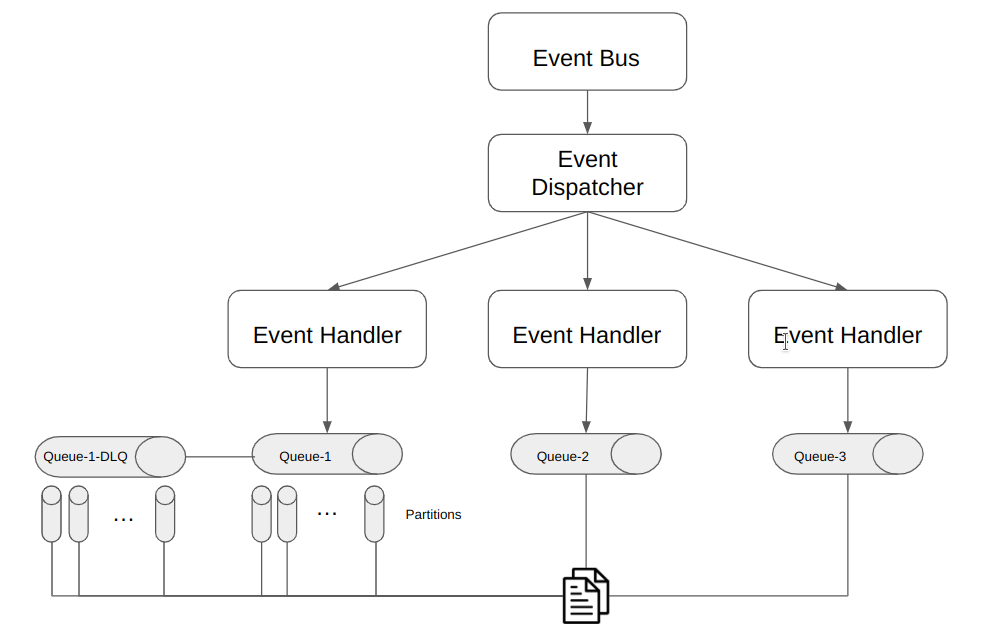

# Event Bus

This project is an implementation of a queueing system using .NET 6. It provides a simple and efficient way to publish and consume events between different components of an application.

## Installation

Use the provided docker to build a docker image.

```bash
docker build . -t eventbus
```

Run an instance of the image

```bash
docker run -p 80:80 eventbus
```

If you want to persist data, run the following command:

```bash
 docker run -p 80:80 -v eventbus:/app eventbus
```

Now the eventbus is running and listening to the port 80. Visit the [swagger](http://localhost/swagger/index.html) page for the documentation and to test it: 

## Architecture



## Contributing

Pull requests are welcome. For major changes, please open an issue first
to discuss what you would like to change.
