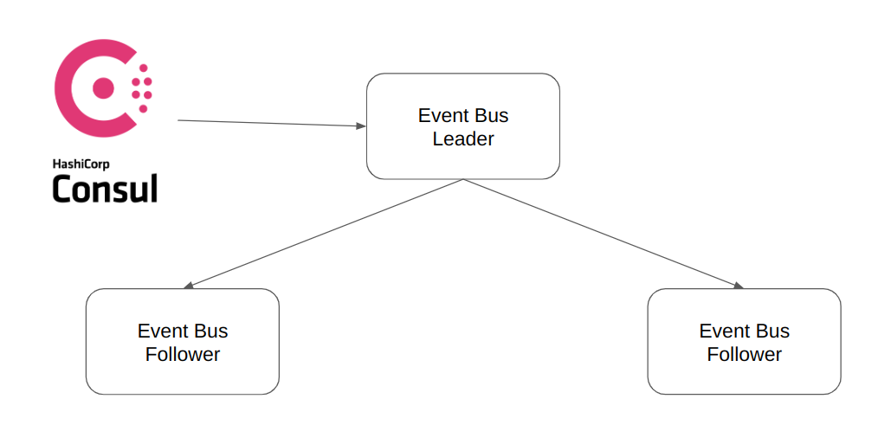

# Event Bus

This project is an implementation of a queueing system using .NET 6. It provides a simple and efficient way to publish and consume events between different components of an application.

## Installation

Use the provided docker image to build a docker image.
Or you can use the docker-compose.yaml file to run multiple instances of service alongside with an instance of consul

```bash
docker-compose up --build
```

Now the eventbus is running and listening to the port 80. Visit the [swagger](http://localhost/swagger/index.html) page for the documentation and to test it: 

## Architecture

The system employs a leader-follower model with leader election facilitated by Consul, ensuring high availability and fault tolerance. Leveraging Consul for service discovery enables dynamic endpoint registration and discovery.



In a single instance of the Event Bus system, the architecture revolves around a central Event Dispatcher component responsible for efficiently routing data to the respective Event Handlers. Each Event Handler manages a queue, which can be configured with one or multiple partitions to optimize parallel processing. Notably, every queue is equipped with a default Dead-Letter Queue (DLQ). The DLQ serves as a safety net for handling events that encounter processing errors or failures. Importantly, the number of partitions within the Dead-Letter Queue aligns with the number of partitions in its corresponding primary queue. This design ensures a robust and fault-tolerant system by isolating and addressing problematic events while maintaining scalability through partitioned queues.


## Contributing

Pull requests are welcome. For major changes, please open an issue first
to discuss what you would like to change.
